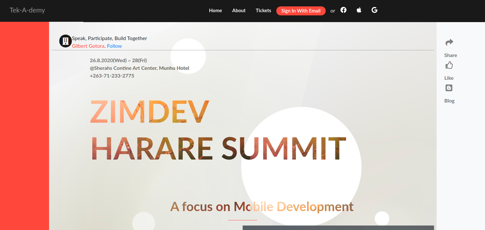

# HTML5-CSS3-Capstone
This HTML &amp; CSS Capstone Project is based on an online website for a conference as part of the Microverse FullStack Developer curriculum.


> This project was developed as a learning project part of the Microverse curriculum.



The aim of the project is to build a website following the design guidelines including

- colors
- typographies: font face, size and weight
- layout: composition and space between elements, for the 2 given screen sizes
   - mobile: up to 768px
   - desktop: from 768px
 based on Cindy Shin's design. [behance.net](https://www.behance.net/gallery/29845175/CC-Global-Summit-2015). 
 The content however has to be personalised.
 
The project requires the use of plain HTML and CSS with the freedom to use the Bootstrap Framework
The use of CSS Flexbox and CSS Grid is a requirement for the projects.
The website must have an about page and a tickets.

## Live demo

🔗 [Tek-A-demmy Conference Page](https://keen-euler-32f6b6.netlify.app/)

## Video demo

[Video_Demo](https://www.loom.com/share/ef72c6a819d943f4a529715f221314ea/)

## Built With

- HTML5
- CSS3
- Google Fonts
- Font awesome
- Bootstrap 4
- Images Courtesy of unsplash.com,  www.freepik.com www.hdwallpaperspulse.com


## Getting Started

To get a local copy up and running follow these simple example steps.
/
### Prerequisites

Web browser and access to internet

### Install

1) [Download](Clone the repository to your machine)

```sh
$ git clone https://github.com/belsman/Building-with-Responsive-Design/tree/develop
```

2) Navigate to the project folder and execute the "index.html" file.

### Usage

Just navigate through the page.

## Author

👤 **Gilbert Gotora**

- Github: [@ggotora](https://github.com/ggotora)

Design idea by Cindy Shin in Behance

## 🤝 Contributing

Contributions, issues and feature requests are welcome!

Feel free to check the [issues page](issues/).

## Show your support

Give a ⭐️ if you like this project!

## Acknowledgments

- Design idea by Cindy Shin in Behance

